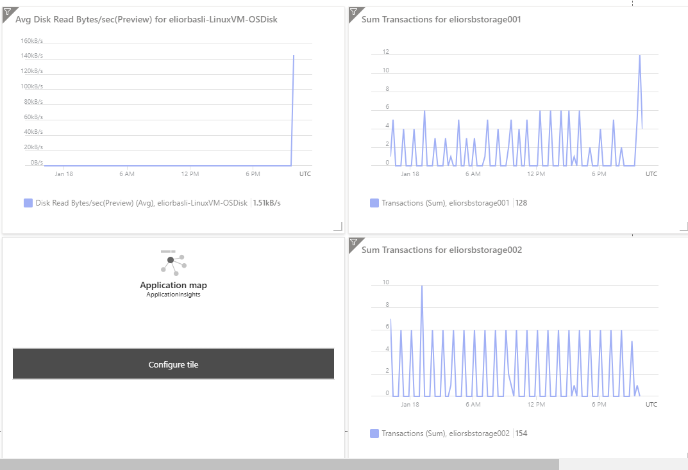

# Azure System Monitoring Dashboard

This project monitors a system with:
- **1 server (VM)**
- **2 storage accounts**

The goal is to display key metrics from the server and storage accounts on an Azure Monitor dashboard.

## Steps to Set Up Monitoring

### 1. Set Up Monitoring for the Server
- Go to the **Azure portal**.
- Select your **Virtual Machine**.
- Under **Monitoring**, enable **Azure Monitor** for metrics like CPU usage, memory, disk I/O, and network traffic.

### 2. Set Up Monitoring for Storage Accounts
- Go to **Storage Accounts** in the Azure portal.
- Select your storage account.
- Under **Monitoring**, enable metrics like **Total transactions**, **Ingress/Egress data**, and **Storage capacity**.

### 3. Create a Dashboard in Azure Monitor
1. Go to **Azure Monitor** in the portal.
2. Click **Dashboards** and then **+ New Dashboard**.
3. Add **Metrics** for the server and storage accounts.
4. Organize the metrics on the dashboard.
5. Save the dashboard.

### 4. Set Up Alerts (Optional)
- You can create alerts in **Azure Monitor** based on metrics, like CPU usage or storage capacity.

## Conclusion

You now have a simple **System Monitoring Dashboard** in Azure to track the health of your server and storage accounts.

